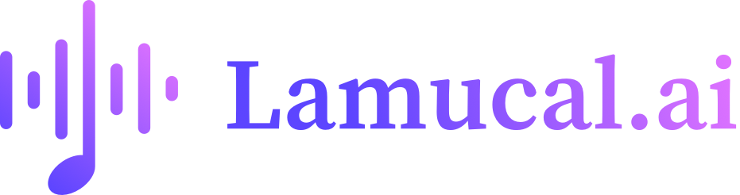

<!-- filepath: c:\Users\marti\MusicTranscribe\Songect\README.md -->
# Songect Desktop Application

**Songect is an AI-powered desktop application designed for musicians, producers, and music enthusiasts. It provides comprehensive music analysis features, including chord detection, key estimation, beat and tempo tracking, pitch analysis, music structure segmentation, lyrics transcription with alignment, and source separation. The application aims to generate playable tablature with editing capabilities, all presented in a user-friendly interface built with PySide6 (Qt for Python).**

<!-- Placeholder for a screenshot of the application -->
<!--  -->

## Core Features

The Songect desktop application allows users to:

*   **Load Audio Files:** Open various audio formats (e.g., WAV, MP3) for analysis.
*   **Comprehensive Music Analysis:**
    *   **Chords & Key:** Detects musical chords (major, minor, 7ths, suspended, etc., including inversions) and determines the overall key of the song.
    *   **Beats & Tempo:** Identifies beat and downbeat locations and tracks the song's tempo (BPM).
    *   **Melody Pitch:** Tracks the pitch contour of the main melody, typically from the vocal track.
    *   **Music Structure:** Segments the song into standard sections like intro, verse, chorus, bridge, etc., with timings.
    *   **Lyrics Transcription & Alignment:** Transcribes lyrics from the vocal track using AI (`openai-whisper`) providing initial word-level timestamps. (Backend structure for Wav2Vec2 alignment refinement is in place; core alignment algorithms are TODOs).
    *   **Source Separation:** Separates audio into distinct stems such as vocals, bass, drums, and other instruments (UI placeholders exist).
*   **Interactive Results Display:** View analysis results in an organized, tabbed interface. Includes time-aligned lyrics highlighting during playback.
*   **Audio Playback:** Control playback of the loaded audio file.
*   **Tablature Display (Basic):** A dedicated tab is available to display generated tablature or chord charts (currently shows placeholder data; rendering logic is a TODO).
*   **Future - AI Tabs:** Generate playable sheet music (chord charts, tablature) based on the analysis, with support for editing chords, rhythm, and lyrics.
*   **Future - Audio Manipulation:** Includes features like audio speed adjustment and pitch shifting.

## Technology Stack

*   **User Interface:** PySide6 (Qt for Python)
*   **Backend & AI Core:** Python
    *   The AI-powered analysis is primarily orchestrated by `python/aitabs.py`.
    *   **Source Separation:** `U-Net` based model.
    *   **Music Information Retrieval (MIR):** Transformer-based models for `Pitch-Net`, `Beat-Net`, `Chord-Net`, and `Segment-Net`.
    *   **Lyrics:** `openai-whisper` for Automatic Speech Recognition (ASR) and initial word timestamps. (Backend structure for fine-tuned `Wav2Vec2` model for alignment refinement is in place; core alignment algorithms are TODOs).
    *   Model implementations can be found in the `python/models/` directory.
*   **Packaging:** PyInstaller (for creating distributable application bundles).

> **Note on AI Model Inputs**: `U-Net` (source separation) and `Segment-Net` use the STFT spectrum of the audio. `Beat-Net` uses spectrograms from separated drum, bass, and other instrument stems. `Chord-Net` uses the spectrogram of the background music (accompaniment).

## Getting Started

These instructions will get you a copy of the project up and running on your local machine for development and testing purposes.

### Prerequisites

*   Python (version 3.8+ recommended)
*   `pip` (Python package installer)
*   `ffmpeg`: Required by `openai-whisper` for audio processing. Ensure it's installed and accessible in your system's PATH.
    *   Windows: Download from [ffmpeg.org](https://ffmpeg.org/download.html) and add the `bin` directory (e.g., `C:\path\to\ffmpeg\bin`) to your PATH.
    *   macOS: `brew install ffmpeg`
    *   Linux: `sudo apt update && sudo apt install ffmpeg`

### Installation & Running

1.  **Clone the repository:**
    ```bash
    git clone <repository_url> # Replace <repository_url> with the actual URL
    cd Songect
    ```

2.  **Create and activate a virtual environment (recommended):**
    ```powershell
    # For PowerShell on Windows
    python -m venv .venv
    .\.venv\Scripts\Activate.ps1
    ```
    ```bash
    # For bash/zsh on macOS/Linux
    python3 -m venv .venv
    source .venv/bin/activate
    ```

3.  **Install dependencies:**
    ```bash
    pip install -r requirements.txt
    ```

4.  **Run the application:**
    ```bash
    python main_ui.py
    ```

## Usage

1.  Launch the application using `python main_ui.py`.
2.  Use the "Open Audio File..." button or File menu option to load a supported audio file (e.g., WAV, MP3).
3.  If a WAV file is loaded, transcription and analysis will begin automatically. For other formats, playback will be available, and a message will indicate that transcription requires WAV.
4.  View analysis results in the corresponding tabs: Summary, Chords & Key, Beats & Tempo, Structure, Melody, Lyrics, Source Separation, and Tablature.
5.  During audio playback, lyrics in the "Lyrics" tab will highlight in sync with the audio (based on Whisper's word timestamps).
6.  Use the audio playback controls (Play, Pause, Stop) as needed.
7.  Access application settings via the "Settings..." button or File menu.

## Project Plan & Future Development

For a detailed breakdown of completed, ongoing, and future development tasks, please refer to the [project_plan.md](project_plan.md) file.

Key upcoming features include:
*   Full implementation of Wav2Vec2 alignment logic for refined word timestamps.
*   Integration of plotting libraries for melody and beat visualization.
*   Development of basic tablature rendering logic.
*   Implementation of audio speed and pitch adjustment features.

## Contributing

(Details on how to contribute to the project, if applicable - e.g., pull request guidelines, coding standards.)

## License

(Specify the license for the project, e.g., MIT, GPL, etc. If not yet decided, mention "License to be determined.")


